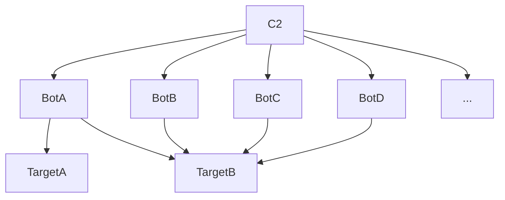

# Botnet

This article talk about botnets and their technologies.

DISCLAIMER: this article is only here for a documentation purpose and is not supposed to be use for malintentionned actions

## PART 1: What is a botnet?

A botnet (robot network) is a network of compromised machines named "bots" and a C2 (Command and Control) server.

The most of time, botnets are used to:
- launch DDoS attacks,
- launch phishing attacks,
- mining cryptocurrencies,
- or launch targeted attacks (in this case the botnet is useful to hide te attacker identity)

## PART II: Botnets functionnalities

### Launch commands

###
