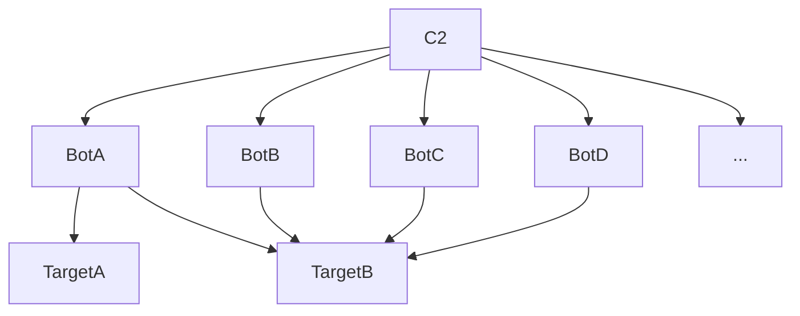

# Botnet

This article talk about botnets and their technologies.

DISCLAIMER: this article is only here for a documentation purpose and is not supposed to be use for malintentionned actions

## PART 1: What is a botnet?

A botnet (robot network) is a network of compromised machines named "bots" and managed by a C2 (Command and Control) server.

The most of time, botnets are used to:
- launch DDoS attacks,
- launch phishing attacks,
- mining cryptocurrencies,
- or launch targeted attacks (botnet allow to hide the attacker identity)

We have to highlight that botnets are malicious and are associated to crime the most of time. But the botnets concept can be used in legal ways, as distributed computing (for example, [bioinc](https://boinc.berkeley.edu/) is a legal botnet)

## PART II: Botnets functionnalities

This part describe the main functionnalities present in botnets.

### Launch commands

The main functionnality of a botnet is to launch commands on a single, many or all the bots.

### Update bots

It is possible for the C2 to send updates to bots.  as the same way you can update a software. 
The update functionnality is important for 2 reasons:
- It allows to update and patch the bots, like a normal software, for example to add a new functionnality.
- and it allows to modify the bots signature and bypass the antivirus checks.

