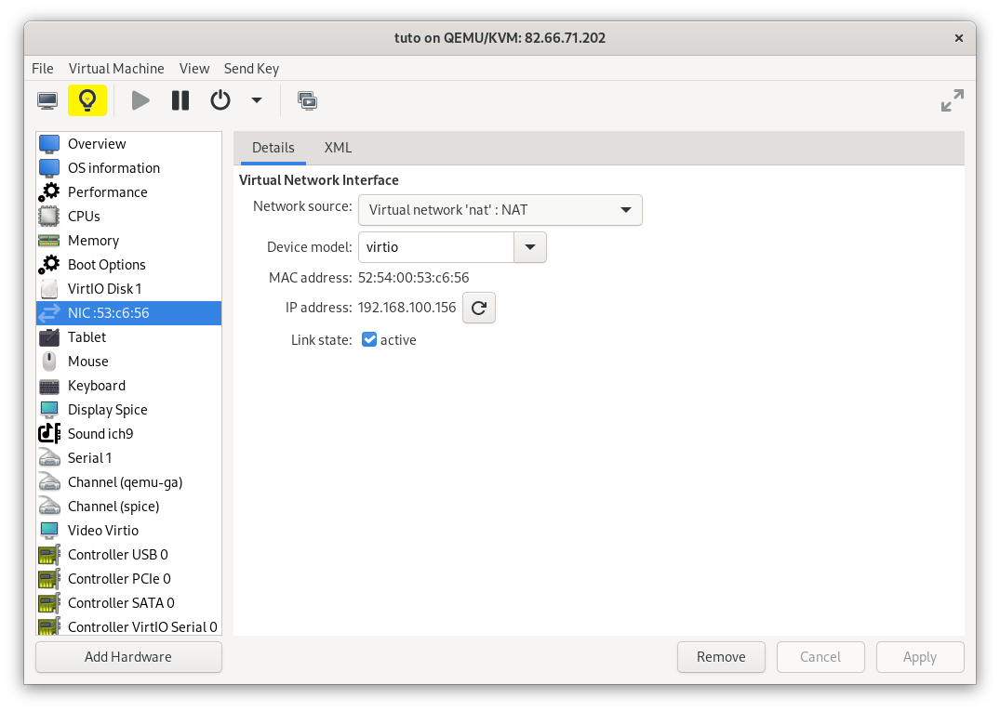

# Deploy service using QEMU and QEMU routing network

In QEMU, there are many network configurations as:
- NAT: (Network address translation) using NAT protocol to allow guest to communicate outside the host,
- bridged: an interface on the hsot machine is created for each guest,
- isolated: a fully isolated network from real world with only guests,
- routed: a network with the host and guests machines.

In this tutorial, we want to create a service in a guest machine (virtual machine) and made it accessible from outside the host machine using the routed network of QEMU. To do this, we will use:
- port forwarding with firewall-cmd,
- netcat to test our connection.

### Motivation

The routed network allows to simulate a real network, which can communicate with real world thanks to the host router. We can also apply firewall rules on the host to protect guests.

### Architecture

The following schema explain the network architecture of a QEMU server with a routing network: 


In this schema:
- the host server is the machine with QEMU/KVM,
- the outside network is the physical network with other computers which may reach the services,
- the routed network is a logical network with VM guests and our services.

### Tutorial conditions

The host machine is a fedora machine. If you are under a debian-like machine, you can use ufw instead of firewall-cmd.

For the tutorial, we will create as example an empty NGINX server. I let you adapt the procedure the software you want.

## I: Configure the network and the machine

To configure configure the routed network and add our VM into, we use the tool virt-manager. You alse can use virsh if you're CLI only.

### Create the routed network

On virt-manager, click right on your connexion -> "details"


Go on the "Virtual networks" tab and click in the bottom right cross to add a new network


Name your network, select the "Routed" mode and select an unused IP address: 


### Configure the virtual machine

Open your virtual machine by double clicking on it


Open the VM details and select the NIC device



Alter the existing network interface or create a new one to use the new routed network, and apply modifications


You have now a virtual machine linked on a routed network. Reboot it to apply the changes.

## II: Open the port with firewall-cmd

To start this tutorial, I suppose that you already have an empty qemu virtual machine linked with a qemu routed network and that you know the ports you must to open for your service.
For our case, we must open the 80 port. 

### Check connectivity between host and guest

At first, we can check the connectivity between the host and the guest with ncat

On the guest, open the required port
```
nc -l 80
```

On the host, try to connect to the guest with the same port:

```
nc 192.168.100.156 80
```

If the connection doesn't work, you probably have a problem in your routing network or with your guest firewall. Be sure that you don't use the default NAT network and the guest firewall is correctly configured.

### enable and open port-forwarding

Once the communication works between host ang guest, we have to make it successful between the guest and outside computers.

> If not yet installed, you can now install firewall-cmd
> If you are under debian-like OS, you have to use ufw isntead of firewall-cmd

To accomplish it, we have first to enable masquerading:

```
[paul@jupiter ~]$ sudo firewall-cmd --add-masquerade 
success
```

And you can now add the port-forwarding rule:

```
[paul@jupiter ~]$ sudo firewall-cmd --add-forward-port=port=8080:proto=tcp:toport=80:toaddr=192.168.100.156
success
```

- port: the port to forward
- toport: the output destination port
- toaddr: the destionation address
In my case, I want to forward each input with the 8080 port to the guest machine with port 80.

### Check connectivity between otuside computer and guest

Now, the port-forwarding is supposed to work. We can check it with a connectivity check as previousely.

Open the port in the guest machine
```
nc -l 80
```

And try to connect an outside machine to the forwared port on the host:

```
paul@fedora:~$ nc 192.168.1.100 8080
```
 
## III: deploy the software on the guest machine

Once the redirection works, the last step is to download and run the required service. In our case, it will be a NGINX server.

### Download the NGINX server

```
[paul@localhost ~]$ sudo dnf install nginx
Last metadata expiration check: 0:08:37 ago on Tue 18 Jun 2024 12:54:44 PM UTC.
Dependencies resolved.

[...]

Complete!
[paul@localhost ~]$ 
```

### Start our server

```
[paul@localhost ~]$ sudo systemctl enable nginx --now
Created symlink /etc/systemd/system/multi-user.target.wants/nginx.service → /usr/lib/systemd/system/nginx.service.
```

### Test our server

The service is availible on on the outside network of our host.

Enjoy 😄
